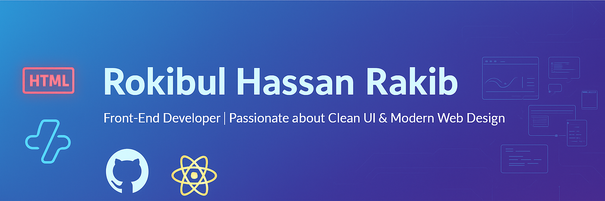

<!--Night Owl image-->

 

  <h1>
     
    ɪ'ᴍ ʀᴏᴋɪʙᴜʟ ʜᴀssᴀɴ ʀᴀᴋɪʙ
  </h1>
  
<strong>Front-End Developer | Crafting Clean UI & Modern Web Experiences</strong>

---

<!-- ================= About Me ================= -->
### 👋 About Me
- MERN Stack Developer | React.js • Node.js • Express.js • MongoDB • MySQL  
- Tailwind CSS & Bootstrap Enthusiast  
- Building scalable web apps from 🇧🇩  
- ✨ Lifelong learner, always exploring new technologies  
- ❤ Passionate about contributing to Open Source  
- 💻 Check out my [Portfolio](https://rokibul-hassan-rakib-portfolio.netlify.app/)  

---

<!-- ================= Profile Views ================= -->

  

---

<!-- ================= Tech Stack & Tools ================= -->
<h2 align="center">💻 Tech Stack & Tools</h2>

  <picture>
    <source media="(prefers-color-scheme: dark)" srcset="./Skills_Animation_Dark.gif">
    <source media="(prefers-color-scheme: light)" srcset="./Skills_Animation_White.gif">
    
  </picture>

---

<!-- ================= Contact & Social ================= -->
<h2 align="center">📫 Contact & Connect</h2>

  Email: <strong>hi.rakibcode@gmail.com</strong>

  
  
  

---

<!-- ================= GitHub Stats ================= -->
<h2 align="center">📊 GitHub Stats</h2>

  

  

  

